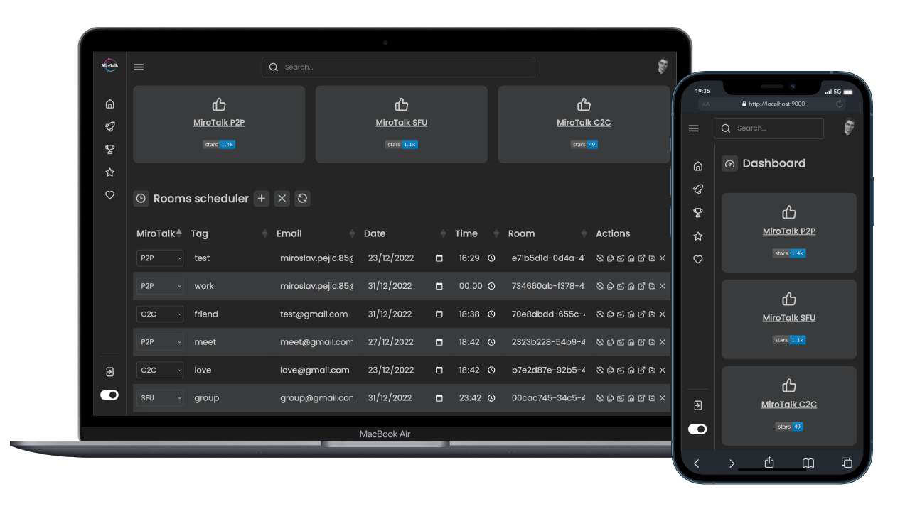

# <p align="center">MiroTalk WebRTC Admin</p>

<hr />

<p align="center">
    <a href="https://webrtc.mirotalk.com">webrtc.mirotalk.com</a>
</p>

> **Note**
> Enter a `valid email`, username and chosen password, `confirm the email` and enjoy!

<hr />

<p align="center">Manage and scheduling all the MiroTalk's WebRTC rooms:</p>

<br/>

| `MiroTalk`                                               | Description                                                                                                                                                                                |
| -------------------------------------------------------- | ------------------------------------------------------------------------------------------------------------------------------------------------------------------------------------------ |
| 🚀 [P2P](https://github.com/miroslavpejic85/mirotalk)    | `Peer to peer` real-time video conferences, optimized for small groups. Unlimited time, unlimited concurrent rooms each having 5-8 participants.                                           |
| 🏆 [SFU](https://github.com/miroslavpejic85/mirotalksfu) | `Selective forwarding unit` real-time video conferences, optimized for large groups. Unlimited time, unlimited concurrent rooms each having 8+ participants.                               |
| ✨ [C2C](https://github.com/miroslavpejic85/mirotalkc2c) | `Cam to cam` (peer to peer) real-time video conferences, optimized for one to one. Unlimited time ,unlimited concurrent rooms each having 2 participants.                                  |
| 📡 [BRO](https://github.com/miroslavpejic85/mirotalkbro) | `Live broadcast` (peer to peer) live video, audio and screen stream to all connected users (viewers). Unlimited time, unlimited concurrent rooms each having a broadcast and many viewers. |



<hr />

<p align="center">
    For questions, discussions, help & support, join with us on <a href="https://discord.gg/rgGYfeYW3N">discord</a>
</p>

<hr />

<details open>
<summary>Quick start</summary>

<br/>

Install [NodeJs](https://nodejs.org/en/blog/release/v18.16.0).

```bash
# Copy .env.template to .env and edit it
$ cp .env.template .env
# Copy config.template.js to config.js and edit it
$ cp frontend/js/config.template.js frontend/js/config.js
```

Change the [MONGO](https://www.mongodb.com/) `URL & DATABASE`, with your own:

```bash
MONGO_URL=mongodb://${MONGO_USERNAME}:${MONGO_PASSWORD}@${MONGO_HOST}:${MONGO_PORT}
MONGO_DATABASE=mirotalk
```

> **Note**
> if you disable the user email verification `EMAIL_VERIFICATION=false` skip this email setup and config.

Setup your email and [app password](https://support.google.com/mail/answer/185833?hl=en):

```bash
EMAIL_HOST=emailHost
EMAIL_PORT=emailPort
EMAIL_USERNAME=emailUsername
EMAIL_PASSWORD=emailPassword
```

```bash
# Install dependencies
$ npm install
# Start the server
$ npm start
```

Open in browser: http://localhost:9000

</details>

<details open>
<summary>Docker</summary>

<br/>


Install [docker](https://docs.docker.com/engine/install/) and [docker-compose](https://docs.docker.com/compose/install/).

```bash
# Copy .env.template to .env and edit it
$ cp .env.template .env
# Copy config.template.js to config.js and edit it
$ cp frontend/js/config.template.js frontend/js/config.js
# Copy docker-compose.template.yml in docker-compose.yml and edit it if needed
$ cp docker-compose.template.yml docker-compose.yml
# Get official image from Docker Hub
$ docker pull mirotalk/webrtc:latest
# Create and start containers (-d as daemon)
$ docker-compose up
```

[Docker official image](https://hub.docker.com/r/mirotalk/webrtc)

</details>

<details>
<summary>Migrations</summary>

<br/>

For MongoDB migrations follow [this README](./database/README.md).

</details>

<details>
<summary>API</summary>

<br/>

You can check the swagger document at http://localhost:9000/api/v1/docs, or live [here](https://webrtc.mirotalk.com/api/v1/docs).

</details>

<details>
<summary>Self hosting</summary>

<br/>

To self-hosting MiroTalk WEB, just follow [this steps](./docs/self-hosting.md).

</details>

<details open>
<summary>Support</summary>

<br/>

You can show your support for MiroTalk's projects by considering sponsorship. By sponsoring MiroTalk on platforms like GitHub Sponsors, you can contribute to our ongoing work and help us continue to develop and improve the projects.

To support MiroTalk's projects, you can visit the sponsorship page at https://github.com/sponsors/miroslavpejic85. There, you will find the different sponsorship tiers available. You can choose a sponsorship level that suits your budget and desired level of support.

Sponsoring MiroTalk's projects not only helps us financially but also encourages our motivation and dedication to creating valuable software. Your sponsorship can enable us to allocate more time and resources towards the projects, leading to further enhancements, bug fixes, and new features.

Thank you for considering supporting MiroTalk's projects. Your sponsorship can make a positive difference and contribute to the success of our endeavors.

</details>

<details>
<summary>License</summary>

<br/>


MiroTalk is free and can be modified and forked. But the conditions of the AGPLv3 (GNU Affero General Public License v3.0) need to be respected. In particular modifications need to be free as well and made available to the public. Get a quick overview of the license at [Choose an open source license](https://choosealicense.com/licenses/agpl-3.0/).

For a MiroTalk license under conditions other than AGPLv3, please contact us at license.mirotalk@gmail.com or [purchase directly via CodeCanyon](https://codecanyon.net/item/a-selfhosted-mirotalks-webrtc-rooms-scheduler-server/42643313).

Thank you!

</details>
